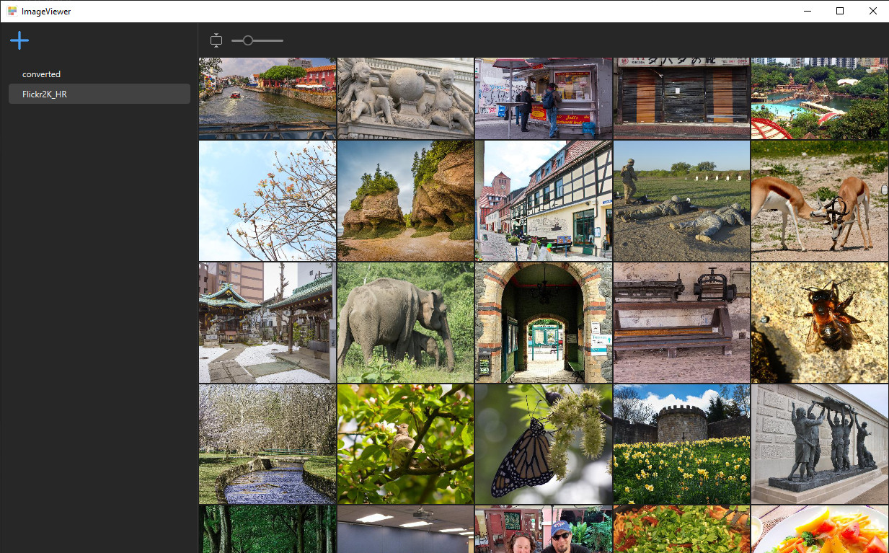

# ImageViewer 

### Cross Platform Image Viewer

An open source image viewer written in JavaFX. Create local image collections
for recursively looking through directories on your local system.
Images are indexed and sorted based on jpeg exif date. It's probably best
to add directories with shallow depth. Currently it will recursively search
with a hardcoded depth of 10. The original use case was to explore images on
a hard disk that were in the following directory structure.

- root
    - 2011
        - 2011-03-28
    - 2020
        - 2020-shoot1
            - 2020-06-13
            - 2020-06-14
        - 2020-shoot2
            - 2020-07-01
            - 2020-07-02
    - 2021
        - 2021-09-16


<p>
    <em>An example screenshot of the application displaying the Flickr2k dataset</em>
</p>

### Performance

When adding new directories, especially directories with many images, indexing will occur on ALL images and may use a
significant amount of CPU. Once indexing is completed subsequent
loads of the application are fast.

The app is a memory hog even if `-Xmx500m` is supplied for
max heap space. Memory usage could likely be improved by reducing
in memory image cache sizes, however the cache needs to be
large enough to hold all on screen images, which can be up to
2,000 (64x64) images when zoomed out.

### File System

Source images will _never_ be modified or deleted. Source images
will only be read. This is an image viewer, not an image editor.

Image indexing cache and database files are located in the
following directory (platform dependent).

- macos:   `{USER_HOME}/Library/Application Support/com.onebyte_llc.imageviewer/`
- windows: `{USER_HOME}\AppData\Local\com.onebyte_llc.imageviewer\`
- linux:   `{USER_HOME}/.com.onebyte_llc.imageviewer/`

### Image Formats

Currently only jpeg and png images are supported. To add other image
formats a `ImageLoader` and `TypeDefinition` need
to be added in `com.onebyte_llc.imageviewer.backend.image`.
Then the new `ImageLoader`  needs to be registered in the
backend `Context` constructor. An example of this is
`JpegImageLoader` and `JpegImageTypeDefinition`.

### Slideshows

A slideshow can be started and stopped by clicking on an image
and then pressing the `space` key.

### Running

To run the java project on any operating system

```
./gradlew run
```

### Building an OS app image

To build a native app image run the following on the target OS.
It should work on macOS, Windows, and Linux. It will create
a standalone executable. 

```
./gradlew jpackageImage
```

### Future Plans

- Support video formats (probably using VLC)
- Support Filtering/sorting images by
    - image creation date
    - image modified date
    - etc.
- Support Face detection
    - this will allow users to name faces and then search/filter

### License

This software is licensed under GPLv2